# sEMG & InBody Data Based 1D-CNN Model for Biceps Fatigue Prediction
 본 프로젝트는 이두근 운동 중 발생하는 근피로를 주관적 표현에만 의존하지 않고, 4채널 sEMG 센서 데이터와 InBody 개인 특성 데이터를 이용해 객관적으로 예측하는 모델을 개발하는 것이다. 기계인공지능 2조(AI in Mechanical Engineering Term Project 2조) 프로젝트이다.


## Project Objective

기존 근피로 평가는 피험자의 주관적 표현이나 관찰자의 판단에 크게 의존했다. 이에 본 프로젝트는 sEMG 신호, 딥러닝 기반 1D-CNN, 그리고 InBody 개인 특성 데이터를 결합해 실시간 이두근 피로도 예측 모델을 구축하는 것을 목표로 했다.

핵심 목표는 다음과 같다.

- sEMG 센서 기반 이두근 운동 중 근활성 신호 실시간 수집
- 수정 Borg scale 기반 피험자 피로도 라벨링
- Butterworth band-pass, notch filter, normalization, sliding window 기반 전처리
- 1D-CNN 모델 기반 피로도 단계 분류
- InBody 특성 데이터 활용을 통한 개인차 반영

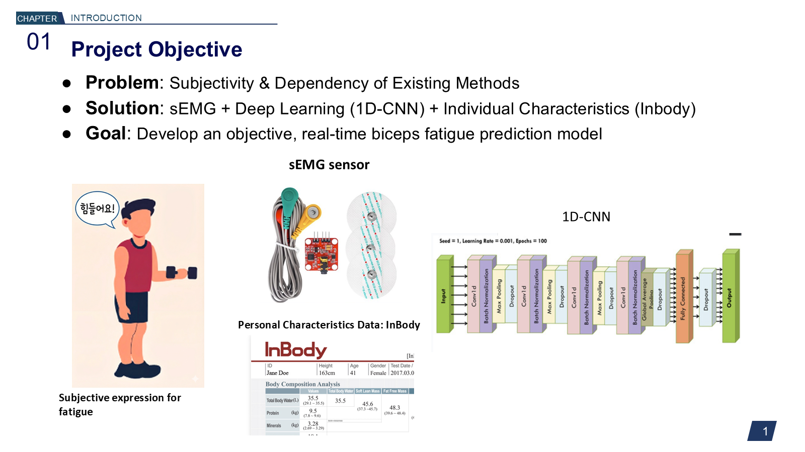

## Theoretical Background

### Borg RPE Scale

Borg RPE(Rating of Perceived Exertion) scale은 운동 강도와 피로도를 모니터링하는 표준적인 주관 지표이다. 심박수, 산소 섭취량과 생리학적 상관성이 높아 재활, 운동부하 검사, 피로도 연구 등에 널리 사용되었다.

본 프로젝트에서는 실험 환경에 맞춰 기존 0-20 또는 0-10 scale보다 직관적인 1-5 단계 scale로 단순화했다. 피험자는 운동 중 본인의 피로감을 실시간으로 표현하고, 해당 시점의 sEMG 데이터에 라벨을 기록했다.

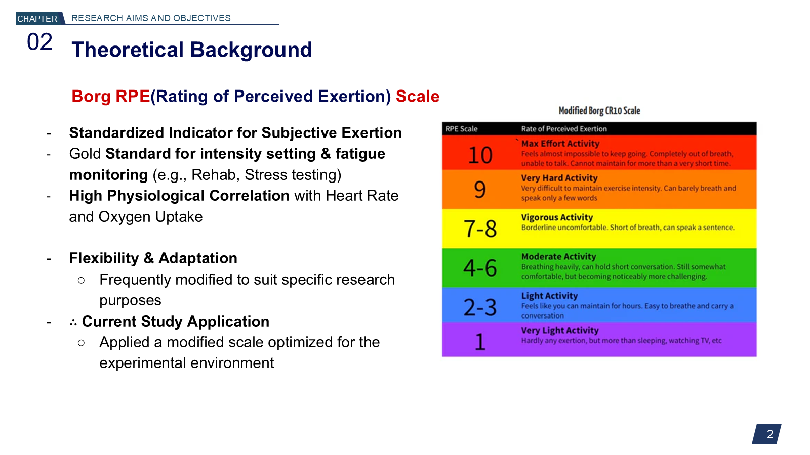

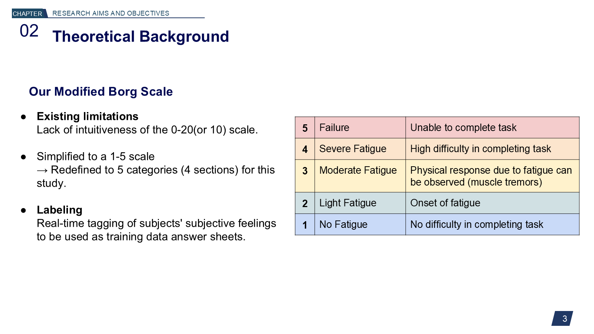

## Research Methodology

### Biceps Curl

이두근은 일상생활 전반에서 팔의 굽힘, 들어올림, 당김, 회전 동작에 중요하게 사용되는 근육이다. 특히 biceps brachii는 피부 표면에 가까운 근육이기 때문에 sEMG 기반 근활성 측정에 적합했다.

본 프로젝트에서는 이두근 피로도를 정량화하기 위해 biceps curl 동작을 사용했다.


### sEMG Sensor

sEMG(surface electromyography)는 비침습적으로 근육의 전기적 활동을 측정할 수 있는 대표적인 방법이다. 반복 측정과 실시간 모니터링이 가능하고, 근피로 변화가 EMG 신호에 민감하게 반영되기 때문에 근력 및 피로도 정량화에 적합했다.

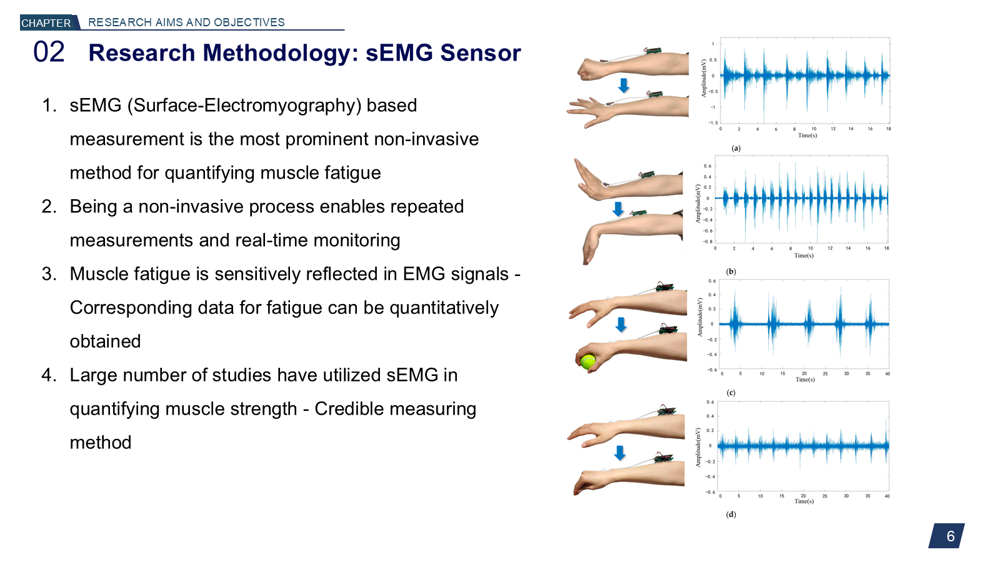

### Sensor Placement

sEMG 센서는 SENIAM(surface electromyography for the non-invasive assessment of muscle) 가이드라인을 참고해 배치했다.

- 이두근 센서: endplate와 tendon 사이, 근섬유 방향과 평행하게 배치
- reference sensor: 근육량이 적은 부위에 배치
- 전완부 센서: 손목 및 전완근 영향을 함께 고려해 추가 배치

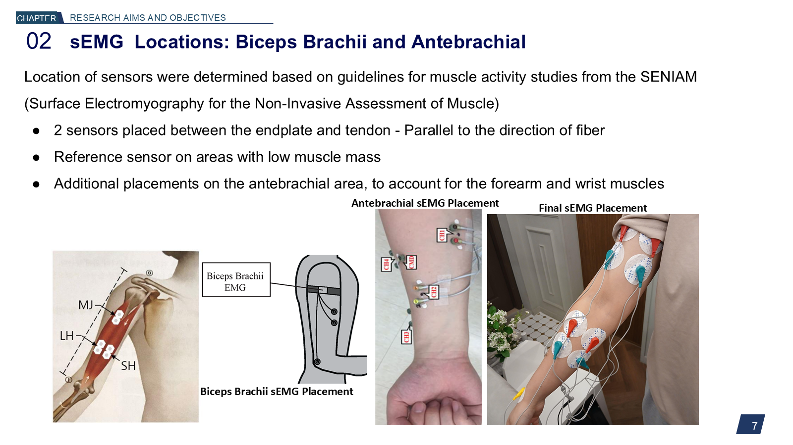

## Mechanical Hardware Design

프로젝트에서는 Arduino UNO R4 WiFi 기반 4채널 sEMG 측정 모듈을 제작했다. 초기 단일 채널 demo test 이후, A0-A3 4개 analog channel을 사용하는 모듈형 sEMG 측정 장치로 확장했다.

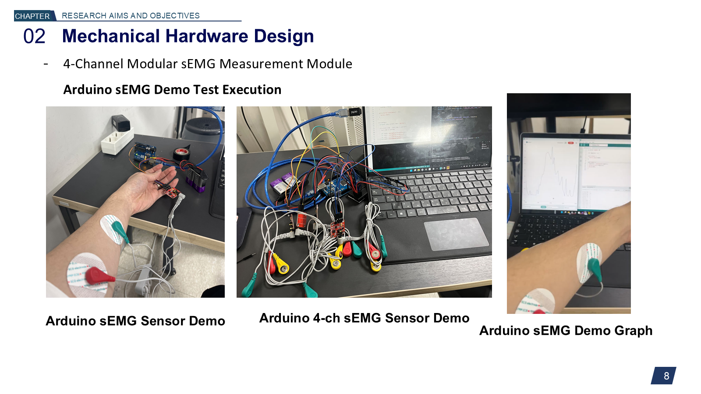

하드웨어 설계에는 wiring design, safety assessment, Arduino sketch, 회로 schematic을 포함했다.

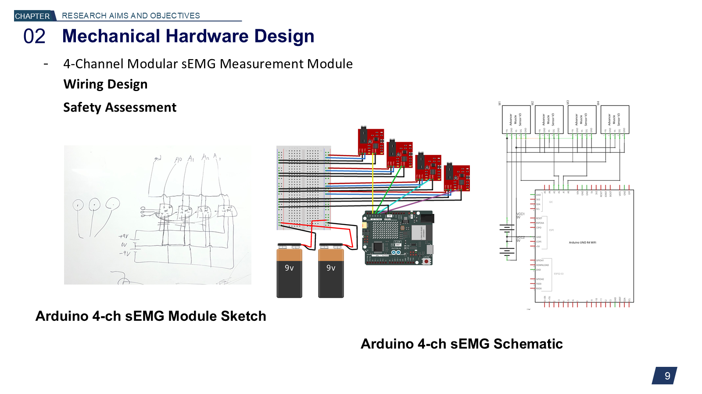

SolidWorks로 4층 구조의 하드웨어 모듈을 설계했다.

- Layer 1: Arduino R4
- Layer 2: sEMG A0, A2
- Layer 3: sEMG A1, A3
- Layer 4: wiring structure

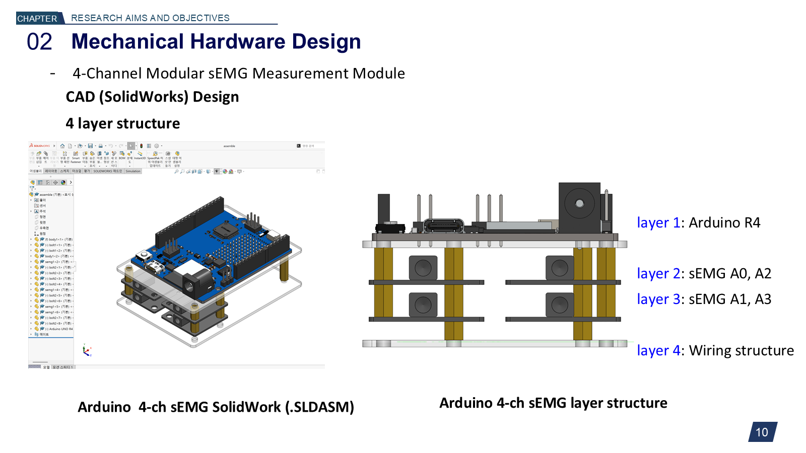

실제 prototype은 6개의 ±9 V 배터리를 사용했으며, 안정성을 높이기 위해 3개씩 두 parallel group으로 구성했다. 최종적으로 A0-A3 4채널 출력 수집에 성공했다.

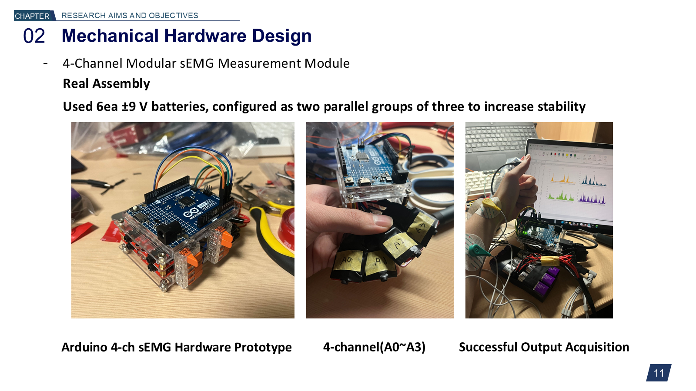

## Experimental Procedure

실험 절차는 다음 순서로 진행했다.

1. 피험자의 InBody를 측정했다.
2. dominant arm에 sEMG 센서를 부착했다.
3. biceps curl을 수행했다.
4. 피험자가 운동 중 “slightly tired”, “tired”, “very tired” 시점을 구두로 표현했다.
5. 각 피로 단계 도달 시간과 반복 횟수를 기록했다.
6. 더 이상 반복 수행이 불가능할 때까지 운동을 지속했다.
7. 전체 운동 시간과 최종 피로도를 기록했다.

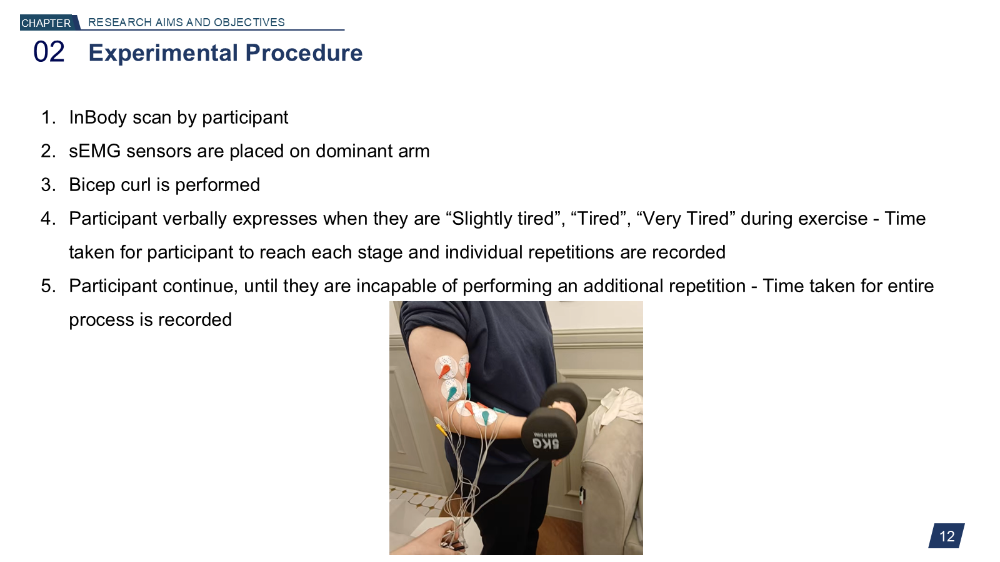

## Dataset

### sEMG Data

수집된 sEMG 데이터는 `sEMG_data/sEMG_data_0.csv`부터 `sEMG_data/sEMG_data_27.csv`까지 저장했다. 각 CSV에는 Arduino 4채널 sEMG 모듈에서 측정한 값과 피로도 라벨을 포함했다.

```text
Ch1,Ch2,Ch3,Ch4,label
60,210,556,375,1
126,31,23,26,1
...
```

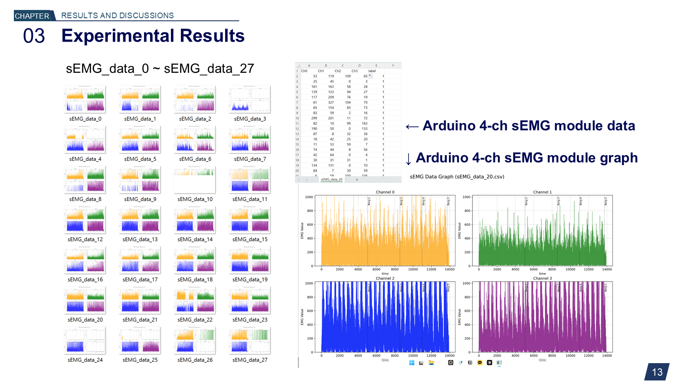

모델링 전 trend analysis에서는 근피로가 진행될수록 sEMG voltage peak에 도달하는 시간이 길어지는 경향을 확인했다.

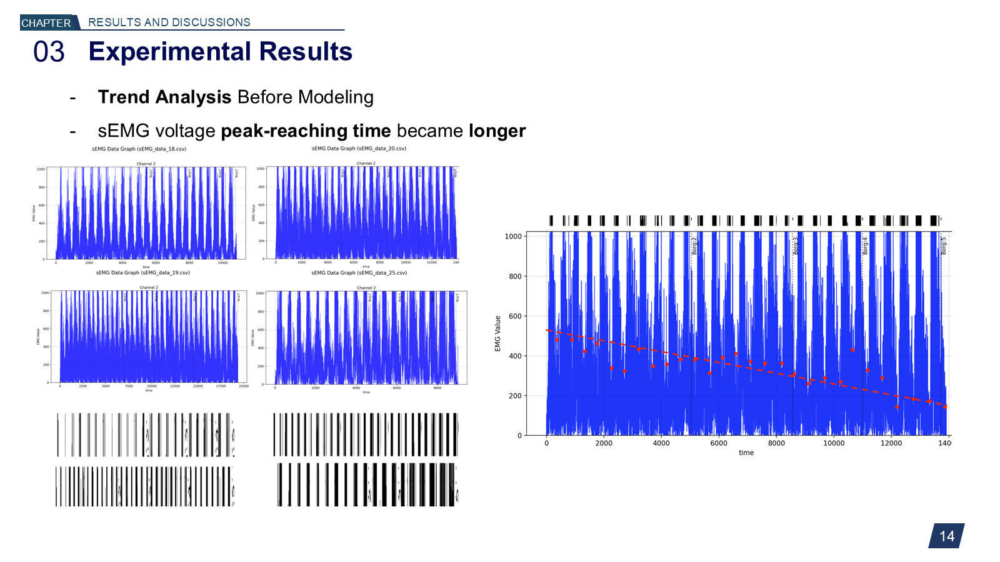

### InBody Data

InBody 데이터는 12명의 피험자를 대상으로 하나스퀘어 Health Care Center에서 측정했다. 측정 feature는 gender, height, weight, SMM, BFM이며, 모델에는 height를 제외한 4개 feature를 사용했다.

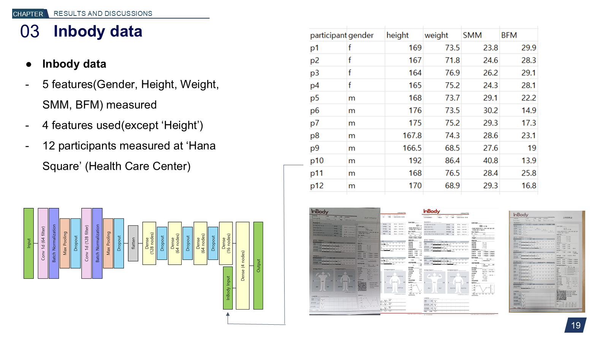

## Data Preprocessing

### Filtering

sEMG 원신호는 다음 필터를 거쳐 전처리했다.

- 4th order Butterworth band-pass filter: `20-95 Hz` 대역 통과
- Notch filter: `60 Hz` power line noise 제거
- Sensor detachment masking filter: 연속 구간 표준편차가 0인 경우 전압 값을 0으로 변환

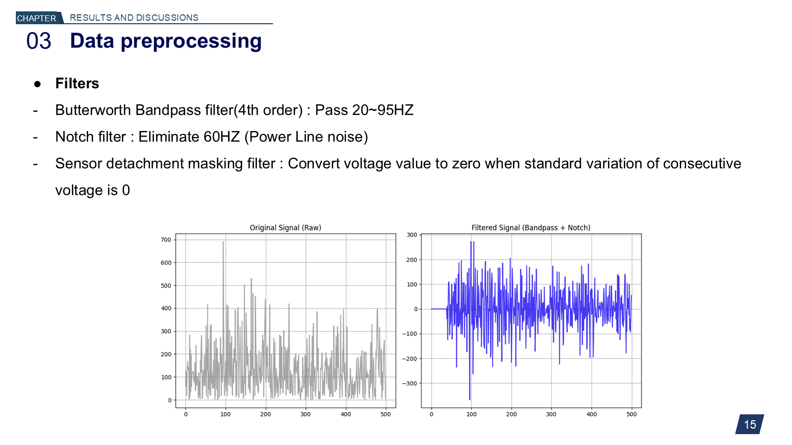

### Normalization

실험에서는 여러 normalization 방법을 비교했다.

- Z-score standardization: 평균 0, 표준편차 1 기준 변환
- MVC(Maximum Voluntary Contraction): 최대 전압 기준 scaling
- Min-Max scaling: 0-1 범위 scaling

CNN 노트북의 주요 설정은 `MVC` normalization이었다.

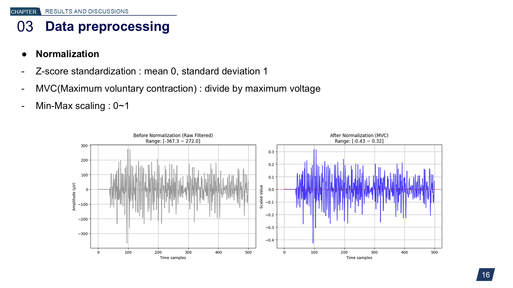

### Window Sliding and Label Encoding

CNN 입력을 만들기 위해 sliding window를 적용했다.

- Sampling rate: `200 Hz`
- Window size: `40`
- Window duration: `0.2 s`
- Overlap: `20`
- Overlap ratio: `50%`
- Input shape: `(40, 4)`

라벨은 sparse categorical cross-entropy loss에 맞춰 `Lv1-Lv5`를 `0-4`로 encoding했다.

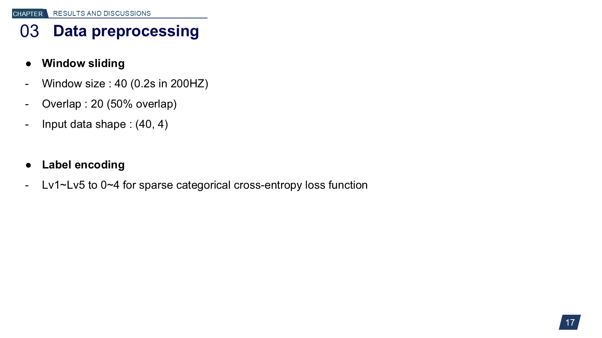

## Model

### 1D-CNN Architecture

모델은 sEMG 시계열 window와 InBody input data를 함께 고려하는 1D-CNN 구조를 목표로 설계했다. sEMG 입력은 `(40, 4)` 형태이며, Conv1D 계층을 통해 시간축 패턴을 학습하도록 구성했다.

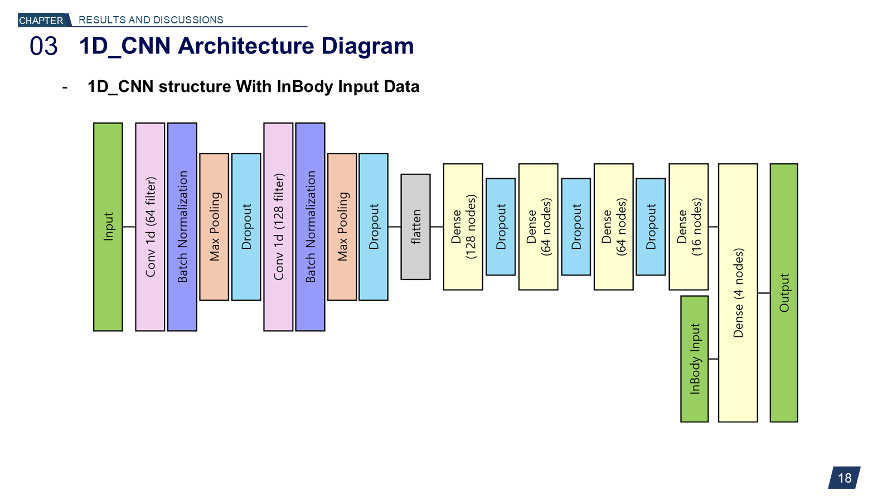

### Training Setup

학습 설정은 다음과 같았다.

- Optimizer: Adam
- Loss function: sparse categorical cross-entropy
- Early stopping 적용
- Callback 적용
- Kernel L2 regularization 적용
- 주요 학습 노트북: `1D_CNN_251206_MVC_ELU.ipynb`

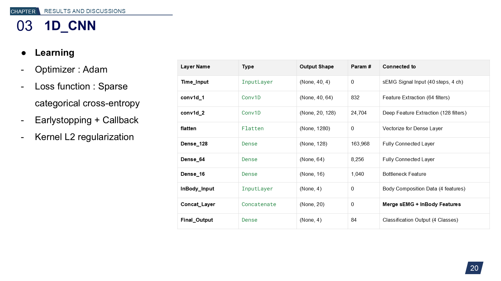

## Results

학습 과정은 loss curve와 accuracy curve로 확인했다. 결과 슬라이드에는 학습/검증 정확도 및 손실 변화를 시각화했다.

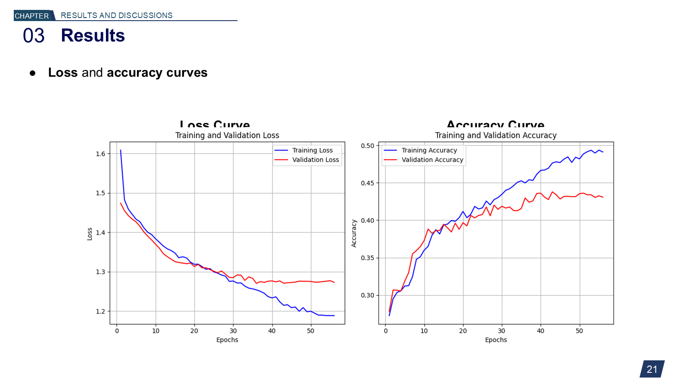

분류 결과는 confusion matrix로 분석했다.

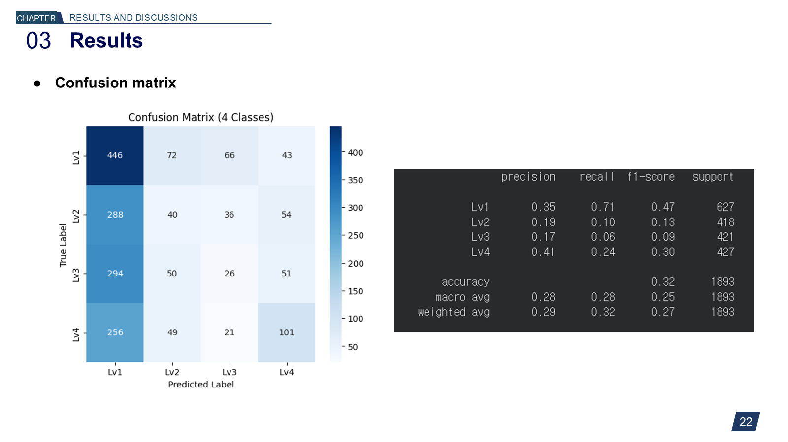

결과 분석에서는 `Lv2`, `Lv3` 구간의 정확도가 낮게 나타났다. 주요 원인은 다음과 같다.

- 피험자 수 부족
- 저가형 센서로 인한 신호 오차 존재
- 센서 고정 안정성 부족
- 낮은 sampling/measurement quality의 영향 가능성

향후 개선 방향은 다음과 같다다.

- 최소 50명 이상의 피험자 데이터 수집
- 더 정확한 sEMG 센서 사용
- 센서 고정 방식 개선
- 더 높은 sampling frequency 확보
- 고도화된 신호 전처리 적용

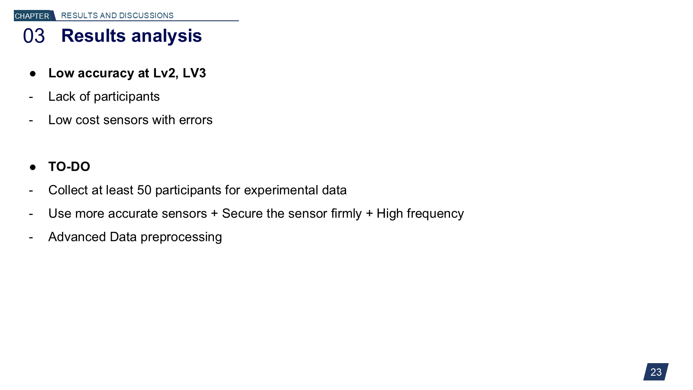

## Repository Contents

```text
AIinME_term_project/
├── AI_ME_2조_최종ppt.pptx
├── 1D_CNN_251206_MVC_ELU.ipynb
├── SVM_sEMG.ipynb
├── README.md
├── assets/
│   └── slides/
│       ├── slide-01.png
│       ├── ...
│       └── slide-25.png
├── arduino_sensor/
│   ├── IMU_demo/IMU_demo.ino
│   ├── sEMG/sEMG.ino
│   ├── sEMG_demo/sEMG_demo.ino
│   └── sketch_demo2/sketch_demo2.ino
├── IMU_data/
│   ├── IMU_data_0.csv
│   └── IMU_data_demo.py
├── sEMG_data/
│   ├── sEMG_data_0.csv ... sEMG_data_27.csv
│   ├── sEMG_data_borg.py
│   └── sEMG_graph.py
└── solidwork/
    └── Arduino UNO R4 WIFI (modified).step
```

## Code Overview

### Arduino

- `arduino_sensor/sEMG/sEMG.ino`: A0-A3 4채널 sEMG analog input을 200 Hz로 serial 출력
- `arduino_sensor/sEMG_demo/sEMG_demo.ino`: 단일 채널 sEMG demo
- `arduino_sensor/IMU_demo/IMU_demo.ino`: MPU6050 yaw/pitch/roll demo
- `arduino_sensor/sketch_demo2/sketch_demo2.ino`: 간단한 analog read demo

### Python

- `sEMG_data/sEMG_data_borg.py`: Arduino serial data를 읽고 `label`과 함께 CSV로 저장
- `sEMG_data/sEMG_graph.py`: sEMG CSV 4채널 데이터 시각화
- `IMU_data/IMU_data_demo.py`: IMU yaw/pitch/roll serial data 저장

### Notebooks

- `1D_CNN_251206_MVC_ELU.ipynb`: filtering, normalization, sliding window, 1D-CNN 학습 및 평가
- `SVM_sEMG.ipynb`: RMS, variance, MPF, MDF feature 기반 SVM baseline 구성

## Dependencies

Python:

```text
pandas
numpy
matplotlib
seaborn
scipy
scikit-learn
tensorflow
pyserial
keyboard
google-colab
```

Arduino:

```text
Wire
I2Cdev
MPU6050_6Axis_MotionApps20
```

## Presentation Slides

아래 이미지는 `AI_ME_2조_최종ppt.pptx`에서 추출한 전체 발표 슬라이드였다.


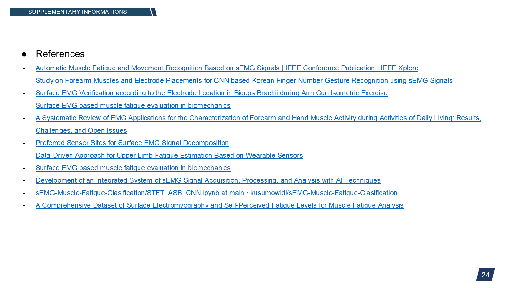


## References

발표자료에서는 sEMG 기반 근피로 평가, 전극 위치 선정, 상지 피로도 추정, wearable sensor, AI 기반 sEMG 수집 및 처리 시스템, 공개 sEMG fatigue classification 예제를 참고했다.


